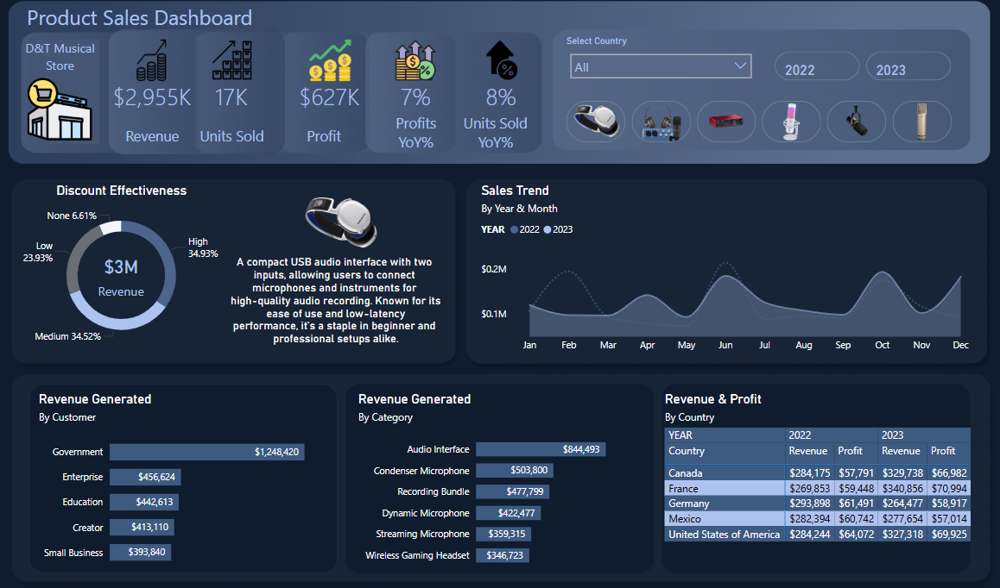

# **Product Sales Analysis - D&T Musical Store**

_Click [Here](https://app.powerbi.com/view?r=eyJrIjoiMTM4YmU1YTktN2RmZS00NDhiLTllYmQtODMwNzQ0MDE3OWJmIiwidCI6ImQ5MTZmMWVjLTA3MDktNDIzNC1iNDgyLTljYjIyOGUwZDk5NyJ9) to interact with the Dashboard_

## **Overview**
This report presents a comprehensive analysis of product sales performance for D&T Musical Store. Leveraging MS SQL, and Power BI, I analyzed key sales metrics, customer segments, product categories, and regional performance to derive actionable insights for business growth.

## **Key Metrics Summary**
- **Revenue:** $2.96M
- **Units Sold:** 17K
- **Profit:** $627K
- **Year-over-Year (YoY) Growth:**
  - **Profit Growth:** +7%
  - **Units Sold Growth:** +8%

## **Insights & Trends**
### **1. Discount Effectiveness**
- Discounts contributed **$3M in revenue**.
- **High discounts (34.93%) drive the most revenue**, followed by medium (34.52%) and low (23.93%).
- **Only 6.61% of revenue comes from non-discounted sales.**

📌 **Actionable Insight:** Optimize discount strategies to balance revenue generation and profitability. The data can be probed further by considering A/B testing on different discount tiers and bundling high-margin products with low-performing ones.

---

### **2. Sales Trend Analysis**
- Sales peaked in **Q4 (October - December)**, aligning with holiday shopping trends.
- Notable dips in **Q2 and early Q3** suggest potential seasonal lulls.

📌 **Actionable Insight:** Align marketing efforts and promotions around peak sales periods to maximize revenue. Implement targeted campaigns during slower months to boost demand.

---

### **3. Customer Segmentation**
- **Government agencies** are the highest revenue-generating customers ($1.25M), followed by Enterprise ($456K) and Education ($442K).
- Small businesses and content creators contribute lower revenue.

📌 **Actionable Insight:** Strengthen relationships with government and enterprise clients while developing tailored offers for small businesses and creators.

---

### **4. Product Category Performance**
- **Top-Selling Product:** Audio Interface ($844K revenue).
- Other strong performers include Condenser Microphones ($503K) and Recording Bundles ($477K).
- **Wireless Gaming Headsets and Streaming Microphones** underperformed.

📌 **Actionable Insight:** Enhance promotional strategies for low-performing products. Introduce bundle deals with high-demand items to improve sales.

---

### **5. Regional Revenue & Profit Analysis**
- **Canada & France saw significant revenue growth** from 2022 to 2023.
- **Germany recorded the lowest revenue and profit growth**, signaling a potential weak market presence.
- **The U.S. maintains the highest profit margins** among analyzed regions.

📌 **Actionable Insight:** Expand marketing efforts in Germany to drive awareness and sales. Leverage localized campaigns and strategic partnerships to improve market penetration.

---

## **Recommendations & Next Steps**
✅ **Refine Discount Strategies** – Implement data-driven discounting models to optimize revenue and profit margins.

✅ **Capitalize on Seasonal Trends** – Increase advertising spend and promotions leading into Q4 to maximize revenue.

✅ **Expand High-Value Customer Base** – Focus on acquiring more government and enterprise clients while introducing tailored solutions for small businesses.

✅ **Enhance Product Marketing** – Boost visibility for underperforming categories through targeted promotions and bundle offers.

✅ **Strengthen Regional Sales in Germany** – Conduct market research to understand local demand and introduce targeted campaigns.

## **Conclusion**
D&T Musical Store is experiencing healthy growth with increasing revenue and profit margins. However, by fine-tuning discount strategies, optimizing marketing efforts, and expanding its customer base, the company can unlock even greater revenue potential. The insights in this report should guide data-driven decision-making to sustain and accelerate business growth.

